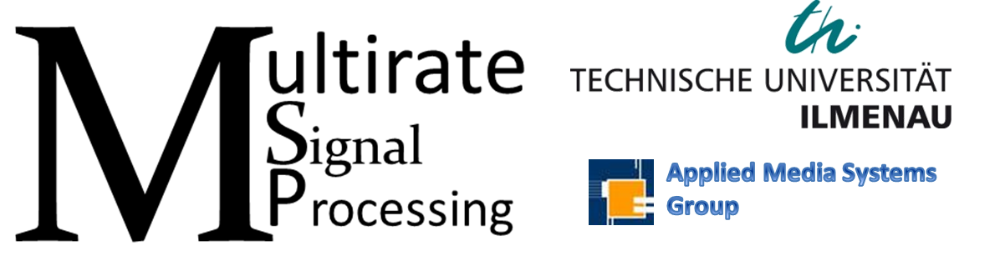

# Multirate Signal Processing Notebooks and Tutorials

    

#### Prof. Dr. -Ing. Gerald Schuller   Jupyter Notebooks and Videos: Renato Profeta
[Applied Media Systems Group](https://www.tu-ilmenau.de/en/applied-media-systems-group/)  
[Technische Universität Ilmenau](https://www.tu-ilmenau.de/)

# Content
- 01 Introduction: 

  - What is Multirate Signal Processing? Where is it used?
  - Python Example of a Discrete Time Signal
  - Python Example for a Live Plot of a Microphone Signal
  - Javascript Example for a Live Plot of a Microphone Signal
  - Nyquist Theorem
  - Simple Sample Rate Conversion Example
  - Basic Building Blocks of Multirate Signal Processing
  - Critical Sampling
  - Analysis Filter Bank
  - Synthesis Filter Bank
  
- 02 Multiresolution: 

  - Uniform Filter Banks
  - Python Example: Live Spectrogram and Aliasing
  - Non-Uniform Frequency Decomposition
  - Frequency Domain and Notation
  - Common Types of Frequency Transforms:
    - Discrete Time Fourier Transform (DTFT)
    - Discrete Fourier Transform (DFT)
    - Discrete Cosine Transform (DCT)
    - z-Transform
    - Short-Time Fourier Transform (STFT)
    
- 03 Frequency Response: 

    - Frequency Response
    - Example: Obtaining the Frequency Response of a "Black Box" system using Noise
    - Example: Obtaining the Frequency Response of a "Black Box" system using Sweeping Sinusoid
    - Frequency Response: z-Transform and the DTFT
        - Example: Low Pass Filter as Moving Average
            - Discrete Convolution as Matrix Multiplication (Sylvester Matrix)
            - Plotting Poles and Zeros in the Complex Plane
    - dB Revision
        - dB for Voltage and Power
        - Cascading Filters
    
  
 # YouTube Playlist
 
 

# Requirements
For the requirements for this project to run, please check the following files at the 'binder' folder:
  - apt.txt
  - requirements.txt
  - postBuild
  
 # Note
 Examples requiring a microphone will not work on remote environments such as Binder and Google Colab. 
